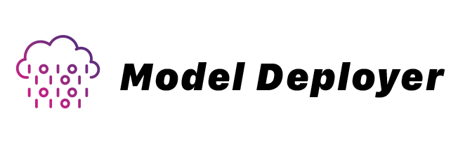

## Model Deployer



<div class="badges" style="text-align: center; margin-top: -20px;">
<a href="https://github.com/themaximal1st/modeldeployer"></a>
<a href="https://www.npmjs.com/package/@themaximalist/modeldeployer"></a>
<a href="https://github.com/themaximal1st/modeldeployer"></a>
<a href="https://github.com/themaximal1st/modeldeployer"></a>
</div>
<br />


[Model Deployer](https://modeldeployer.com) is the simplest way to deploy AI models for your applications.

**Features:**

* Proxy to hundreds of local and remote AI models (LLM, Stable Diffusion, VectorDBs)
* A single interface for all LLM models, built on [LLM.js](https://llmjs.themaximalist.com)
* A single interface for all embeddings, built on [Embeddings.js](https://embeddingsjs.themaximalist.com)
* Easily view usage history for each app user
* Rate-limit users based on pre-defined limits
* Track cost and usage cross hundreds of AI models
* Free, paid, and user-provided API key are supported
* Prevent free users from consuming your API tokens
* Pre-pay with credits *(coming soon)*
* Monthly subscription *(coming soon)*
* Self-hosted or hosted at [Model Deployer](https://modeldeployer.com)
* MIT License


## Install

Model Deployer requires a Postgres DB setup.

Then in your shell, install from GitHub:

```bash
git clone https://github.com/themaximal1st/ModelDeployer.git
cd ModelDeployer
npm install
cp .env.template .env # edit DB connection
npm run dev
```

Visit [http://localhost:3000](http://localhost:3000) and you'll see Model Deployer.


You should be able to create a user, a model, and an API key.

## LLM

Then you can use [LLM.js](https://llmjs.themaximalist.com) to interact with your API:

```javascript
import LLM from "@themaximalist/llm.js"
await LLM("what color is the sky?", {
    service: "modeldeployer",
    model: "api-key"
});
```

Your LLM request will use whatever model and settings you setup in Model Deployer.

## Embeddings

Model Deployer also works with [Embeddings.js](https://embeddingsjs.themaximalist.com).

```javascript
import Embeddings from "@themaximalist/embeddings.js"
await Embeddings("what color is the sky?", {
    service: "modeldeployer",
    model: "api-key"
});
```

Just like with using Model Deployer with Large Language Models, your text embedding request will use whichever model and settings you've setup.

## Vector Database

Model Deployer also works with [VectorDB.js](https://vectordbjs.themaximalist.com)—an in-memory text similarity database.

Because `VectorDB.js` works with `Embeddings.js`—simply pass the `service` and `model` as an option.

```javascript
import VectorDB from "@themaximalist/vectordb.js"
const db = new VectorDB({
  embeddings: {
    service: "modeldeployer",
    model: "api-key",
  }
});

await db.add("orange");
await db.add("blue");

const result = await db.search("light orange");
// [ { input: 'orange', distance: 0.3109036684036255 } ]
```

## Why does Model Deployer exist?

I built [LLM.js](https://llmjs.themaximalist.com) because I wanted to give people control over how they use AI models in their apps.

It's great to use GPT-4 and Claude, but it sucks to get locked in. And it's hard to use local models.

`LLM.js` solves these problems, by creating a single simple interface that works with dozens of popular models.

As great as it is, it doesn't fully solve the problem.

Bundling an app with a local model is not practical, the binaries are hundreds of MBs or even GBs.

Downloading the model on first start also isn't practical. Some users will patiently sit through this, but most won't. The first 10 seconds mean everything on a new app—making users wait will not work.

**How do you offer the power of server models, with the flexibility of local open-source models?**

Model Deployer is the solution. It's an open-source server to manage models for your users. It trades a little bit of privacy for user experience.

Importantly, it's built on a 100% open stack. So for users who care, (if you're reading this you probably care), there are ways to go fully local, and self hosted.

This accomplishes the best of both worlds. Free, open-source, MIT licensed model deployment tech that integrates into the existing remote/local AI toolchain.


## License

MIT


## Author

Created by [The Maximalist](https://twitter.com/themaximal1st), see our [open-source projects](https://themaximalist.com/products).

